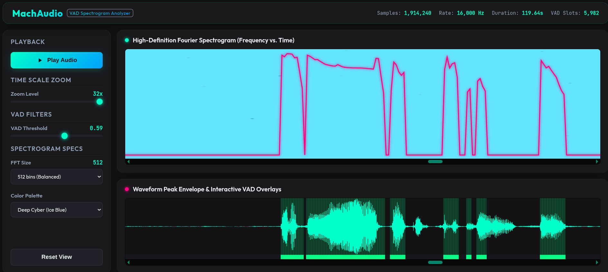

# MachAudio Micro-GRU VAD

The **Micro-GRU VAD (Voice Activity Detection)** engine in MachAudio is a hyper-optimized, low-latency recurrent neural network designed for real-time edge speech detection.

Unlike traditional VAD systems that rely on expensive spectral features (like MFCCs or FFT bins), this implementation extracts purely temporal energy features, driving a Gated Recurrent Unit (GRU) with extreme computational efficiency.

## 1. Architecture Overview

* **Input Processing:** Operates directly on raw 16-bit signed PCM audio at **16kHz**.
* **Frame Size:** Analyzes audio in **20ms frames** (320 samples).
* **Feature Extraction:** The 20ms frame is subdivided into 20 micro-segments (1ms / 16 samples each). The mean absolute volume (energy) of each segment is normalized to a `[-1.0, 1.0]` range and scaled via a log function: `logf(1.0f + energy * 10.0f)`. This yields a 20-dimensional feature vector per frame.
* **Inference Engine:** The 20-dimensional vector is fed into a single-layer GRU (Hidden Dimension: 24), followed by a Fully Connected (FC) layer and a Sigmoid activation to yield a speech probability `[0.0, 1.0]`.

### High-Performance SIMD (AVX2)

To hit single-digit microsecond latency, the inference engine (`src/processing/vad_gru.c`) is fully vectorized using AVX2 intrinsics. Because standard math library functions like `expf()` and `tanhf()` are too slow for ultra-low-latency targets, the implementation uses custom 5th-order Taylor polynomial approximations tailored for SIMD registers.

## 2. Dataset & Training Sensitivities

Because the model exclusively uses **temporal amplitude envelopes** rather than frequency profiles (pitch, formants), it has unique sensitivities engineers must be aware of during training and evaluation:

* **Sensitivity to Room Tone:** Natural human speech always contains a noise floor or room tone. If evaluated against perfectly clean synthetic TTS (Text-to-Speech) audio, the absolute digital zero between words causes the GRU's hidden state to aggressively plummet, resulting in low speech probabilities (~0.20) during playback.
* **Volume Normalization:** The feature extraction relies heavily on absolute amplitude. Testing with audio streams at significantly lower volumes than the training data will result in false negatives.
* **Training Recommendations:** Training datasets must be intentionally augmented. Pure digital silence and synthetic low-level white noise must be included as "non-speech" (0) labels to prevent out-of-distribution drift. If the target use case includes TTS agents, TTS data *must* be included in the training set to acclimatize the model to synthetic amplitude envelopes.

---

## 3. VAD Spectrogram Dashboard



To assist in debugging false positives, threshold tuning, and analyzing temporal offsets, we bundle a powerful Node.js script that generates a self-contained interactive visualization dashboard.

The dashboard features a hardware-accelerated WebGL Spectrogram synced perfectly with a Waveform peak envelope and a continuous VAD probability line graph.

### Generating a Dashboard

You will need:

1. A raw 16-bit signed PCM file (Mono, 16kHz).
2. A VAD probability output file (can be plain text numbers separated by newlines, or a binary file of Float32 little-endian values).

Run the generator script:

```bash
./scripts/create_vad_dashboard.sh <audio_pcm_file> <vad_probabilities_file> <output_html_file>
```

**Example:**

```bash
./scripts/create_vad_dashboard.sh test_audio_16k.pcm vad_output.txt my_dashboard.html
```

### Using the Dashboard

1. **Self-Contained:** The resulting `.html` file is entirely self-contained. The audio and VAD data are Base64 encoded inside the file, meaning you can easily share the file with other engineers over Slack or email.
2. **Playback:** Click "Play Audio" to playback the raw PCM via the browser's Web Audio API. A synced playhead will sweep across the visualizers.
3. **Interactive Thresholding:** Use the sidebar sliders to adjust the VAD threshold dynamically. The UI will instantly highlight which parts of the timeline are classified as active speech versus silence based on your selected cutoff.
4. **Spectrogram Tuning:** Toggle between FFT sizes (256, 512, 1024) and color palettes (Magma, Matrix, Cyan) to isolate specific frequency artifacts that might be triggering false positives.
